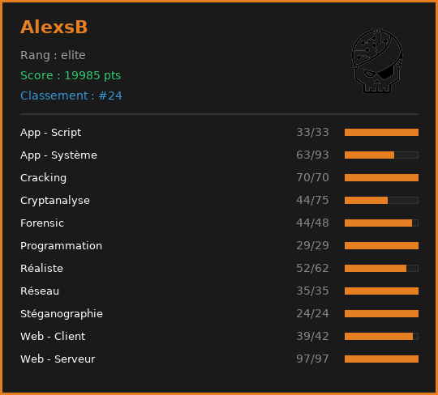

# Root-Me Badge Generator

## Features 

- **Données Root-Me:** Taux de réussite basé sur le nombre de challenges présent par catégories et validés par l'utilisateur.
- **Gestion de session:** Récupération de la session (`spip`) via la librairie python browser-cookie3 (Chrome, Firefox, Edge, etc.).
- **Visuel:** Génère un badge au format PNG affichant les différentes catégories et informations de l'utilisateur.

## Prérequis 

Avant de lancer le script, assurez-vous d'avoir installé les dépendances nécessaires :

```bash
python3 -m pip install -r requirements.txt
```
Assurez-vous de récupérer l'UID de votre utilisateur sur la page Root-Me dans vos paramètres.
Assurez-vous de vous êtes connecté au moins via n'importe quel navigateur afin de ne pas avoir de problème de session spip.

Exemple d'utilisation de l'outil : 

```bash
python3 badge_generator.py 123456
```

Rendu visuel final : 


